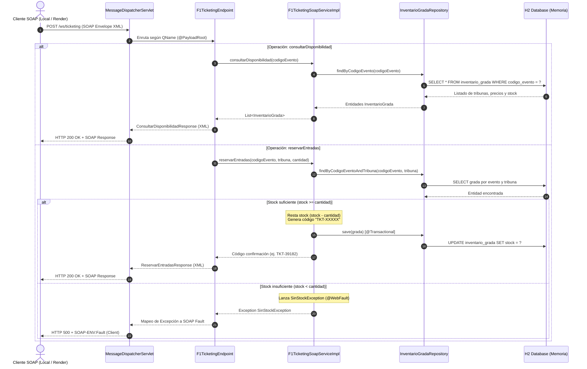

# F1 Ticketing Legacy SOAP Service (`f1-ticketing-legacy-soap`)

Microservicio backend independiente desarrollado en **Java 17 / Spring Boot**, diseñado para simular el **proveedor oficial de entradas de la Fórmula 1**. Al concebirse como un sistema corporativo de naturaleza **Legacy**, toda la comunicación hacia el exterior se realiza de forma estricta mediante el protocolo **XML/SOAP 1.1**.

---

## 1. La Idea del Sistema

En las arquitecturas empresariales modernas es habitual convivir con sistemas centrales existentes (*legacy providers*). Este proyecto recrea dicho escenario:
* **Rol:** Proveedor central de inventario y reservas de localidades para las carreras oficiales de la Fórmula 1 (temporadas 2026/2027).
* **Protocolo Estricto:** No expone endpoints REST/JSON. Toda comunicación exige sobres **SOAP Envelope** validados mediante un contrato formal **WSDL 1.1** y esquemas **XSD**.
* **Persistencia Integrada:** Utiliza una base de datos relacional en memoria (H2) precargada con información masiva y fidedigna de las 19 carreras y 76 tribunas del calendario oficial.
* **Transaccionalidad Atómica:** Garantiza que las compras decrementen el stock en tiempo real de forma segura y consistente bajo concurrencia.

---

## 2. Cómo Funciona Internamente

El sistema opera bajo un flujo de procesamiento por capas altamente desacopladas:



### Flujos Clave:
1. **Carga Inicial Masiva:** Al arrancar la aplicación, Spring Boot ejecuta automáticamente `src/main/resources/data.sql`, poblando la base de datos relacional H2 con **76 tribunas** pertenecientes a **19 Grandes Premios** (Madrid, Bakú, Singapur, Austin, México, São Paulo, Las Vegas, Lusail, Mónaco, etc.).
2. **Consulta de Disponibilidad:** Recibe el código del Gran Premio (ej. `F1-2026-MAD`) y retorna todas las tribunas con su categoría (`VIP`, `Premium`, `Standard`, `General`), precio unitario en USD y stock remanente.
3. **Reserva Transaccional:** Busca la grada especificada de forma atómica. Si existe disponibilidad, reduce el stock, confirma la transacción en base de datos (`@Transactional`) y devuelve un código de ticket alfanumérico generado (`TKT-XXXXX`).
4. **Manejo Estandarizado de Fallos:** Si el stock solicitado excede el disponible, o la tribuna no existe, el sistema interrumpe la operación y genera un **SOAP Fault** estandarizado con código `SOAP-ENV:Client`.

---

## 3. Patrones de Diseño y Arquitectura Utilizados

El microservicio aplica patrones de software reconocidos y estándares empresariales de Java y Jakarta EE:

| Patrón de Diseño | Componente / Implementación | Propósito |
| :--- | :--- | :--- |
| **Front Controller Pattern** | `MessageDispatcherServlet` | Intercepta de forma centralizada todas las peticiones dirigidas a `/ws/*`, gestionando el ciclo de vida del mensaje SOAP, la serialización/deserialización XML y la publicación dinámica del WSDL. |
| **Endpoint / Controller Pattern** | `F1TicketingEndpoint` (`@Endpoint`, `@PayloadRoot`) | Desacopla el transporte HTTP de la lógica de enrutamiento; procesa el mensaje inspeccionando el elemento raíz XML (`QName`) y el namespace `http://f1.ticketing.soap/legacy`. |
| **Service Layer Pattern** | `F1TicketingSoapService` & `F1TicketingSoapServiceImpl` | Encapsula la lógica de negocio y las reglas de validación de entradas, exponiendo una interfaz de contrato `@WebService` y `@WebMethod` (JAX-WS). |
| **Repository Pattern** | `InventarioGradaRepository` (`JpaRepository`) | Abstrae completamente el acceso y las operaciones CRUD hacia la base de datos relacional sin acoplar la lógica de negocio a sentencias SQL manuales. |
| **Data Transfer Object (DTO)** | Paquete `dto.*` (`ConsultarDisponibilidadRequest`, etc.) | Objetos estructurados y anotados con JAXB (`@XmlRootElement`, `@XmlElement`) que definen el contrato XML de entrada y salida, aislándolo del modelo relacional interno. |
| **Adapter Pattern** | `LocalDateAdapter` (`XmlAdapter<String, LocalDate>`) | Transforma bidireccionalmente el tipo Java moderno `java.time.LocalDate` al formato estándar de fecha ISO-8601 (`YYYY-MM-DD` / `xs:date`) requerido por el esquema XSD. |
| **Unit of Work & ACID Transactions** | `@Transactional` en `reservarEntradas` | Asegura que la consulta, la validación y el descuento de stock se ejecuten de manera atómica, consistente y aislada, evitando problemas de concurrencia (*race conditions*). |
| **Exception Shielding / Fault Mapping** | `SinStockException` (`@WebFault`, `@SoapFault`) | Oculta los detalles internos del sistema ante fallos de negocio, transformando la excepción Java en un sobre SOAP Fault (`<SOAP-ENV:Fault>`) estructurado y comprensible para cualquier cliente SOAP. |
| **Contract-Driven / Code-First Hybrid** | `WebServiceConfig` + `DefaultWsdl11Definition` + `WSDL4J` | Combina anotaciones Jakarta EE JAX-WS Code-First con la generación dinámica del contrato WSDL 1.1 a partir del esquema `ticketing.xsd`. |

---

## 4. Endpoints y Entornos de Ejecución

El servicio puede consumirse de forma **Local** o en la **Nube (Render)**:

| Recurso | Entorno Local | Entorno en la Nube (Render) |
| :--- | :--- | :--- |
| **Contrato WSDL 1.1** | `http://localhost:8080/ws/ticketing.wsdl` | `https://<tu-app>.onrender.com/ws/ticketing.wsdl` |
| **Endpoint SOAP (POST)** | `http://localhost:8080/ws/ticketing` | `https://<tu-app>.onrender.com/ws/ticketing` |
| **Consola H2 Web** | `http://localhost:8080/h2-console` | *Deshabilitada externamente por seguridad* |

> **Nota para llamadas en Render:** Reemplaza `<tu-app>.onrender.com` por el subdominio asignado a tu servicio en Render (ej. `f1-ticketing-legacy-soap.onrender.com`).

---

## 5. Guía de Consumo de los Endpoints

Todas las peticiones deben enviarse mediante **HTTP POST** con la cabecera:
```http
Content-Type: text/xml; charset=utf-8
```

---

### Operación 1: Consultar Disponibilidad (`consultarDisponibilidadRequest`)

Permite obtener la lista completa de gradas disponibles, categorías, tarifas y stock para una carrera.

#### Sobre SOAP XML (Petición):
```xml
<soapenv:Envelope xmlns:soapenv="http://schemas.xmlsoap.org/soap/envelope/"
                  xmlns:leg="http://f1.ticketing.soap/legacy">
   <soapenv:Header/>
   <soapenv:Body>
      <leg:consultarDisponibilidadRequest>
         <leg:codigoEvento>F1-2026-MAD</leg:codigoEvento>
      </leg:consultarDisponibilidadRequest>
   </soapenv:Body>
</soapenv:Envelope>
```

#### Respuesta XML Exitosa (HTTP 200 OK):
```xml
<SOAP-ENV:Envelope xmlns:SOAP-ENV="http://schemas.xmlsoap.org/soap/envelope/">
   <SOAP-ENV:Header/>
   <SOAP-ENV:Body>
      <ns2:consultarDisponibilidadResponse xmlns:ns2="http://f1.ticketing.soap/legacy">
         <ns2:gradas>
            <ns2:id>1</ns2:id>
            <ns2:codigoEvento>F1-2026-MAD</ns2:codigoEvento>
            <ns2:carrera>Madrid</ns2:carrera>
            <ns2:fechaCarrera>2026-09-11</ns2:fechaCarrera>
            <ns2:tribuna>Paddock Club Madrid</ns2:tribuna>
            <ns2:categoria>VIP</ns2:categoria>
            <ns2:precioUsd>3500.00</ns2:precioUsd>
            <ns2:stock>500</ns2:stock>
         </ns2:gradas>
         <!-- Resto de gradas del Gran Premio -->
      </ns2:consultarDisponibilidadResponse>
   </SOAP-ENV:Body>
</SOAP-ENV:Envelope>
```

#### Cómo Invocarlo:

* **De forma Local (cURL):**
  ```bash
  curl -X POST http://localhost:8080/ws/ticketing \
    -H "Content-Type: text/xml; charset=utf-8" \
    -d "<soapenv:Envelope xmlns:soapenv=\"http://schemas.xmlsoap.org/soap/envelope/\" xmlns:leg=\"http://f1.ticketing.soap/legacy\"><soapenv:Body><leg:consultarDisponibilidadRequest><leg:codigoEvento>F1-2026-MAD</leg:codigoEvento></leg:consultarDisponibilidadRequest></soapenv:Body></soapenv:Envelope>"
  ```

* **En la Nube / Render (cURL):**
  ```bash
  curl -X POST https://<tu-app>.onrender.com/ws/ticketing \
    -H "Content-Type: text/xml; charset=utf-8" \
    -d "<soapenv:Envelope xmlns:soapenv=\"http://schemas.xmlsoap.org/soap/envelope/\" xmlns:leg=\"http://f1.ticketing.soap/legacy\"><soapenv:Body><leg:consultarDisponibilidadRequest><leg:codigoEvento>F1-2026-MAD</leg:codigoEvento></leg:consultarDisponibilidadRequest></soapenv:Body></soapenv:Envelope>"
  ```

* **Con PowerShell (Windows):**
  ```powershell
  # Cambiar la URL por localhost:8080 o https://<tu-app>.onrender.com
  $url = "http://localhost:8080/ws/ticketing"
  $xml = @"
  <soapenv:Envelope xmlns:soapenv="http://schemas.xmlsoap.org/soap/envelope/" xmlns:leg="http://f1.ticketing.soap/legacy">
     <soapenv:Body>
        <leg:consultarDisponibilidadRequest>
           <leg:codigoEvento>F1-2026-SAO</leg:codigoEvento>
        </leg:consultarDisponibilidadRequest>
     </soapenv:Body>
  </soapenv:Envelope>
  "@

  Invoke-RestMethod -Uri $url -Method Post -ContentType "text/xml; charset=utf-8" -Body $xml
  ```

---

### Operación 2: Reservar Entradas (`reservarEntradasRequest`)

Valida el inventario, descuenta la cantidad solicitada y genera un código oficial de confirmación.

#### Sobre SOAP XML (Petición de Reserva):
```xml
<soapenv:Envelope xmlns:soapenv="http://schemas.xmlsoap.org/soap/envelope/"
                  xmlns:leg="http://f1.ticketing.soap/legacy">
   <soapenv:Header/>
   <soapenv:Body>
      <leg:reservarEntradasRequest>
         <leg:codigoEvento>F1-2026-MAD</leg:codigoEvento>
         <leg:tribuna>Paddock Club Madrid</leg:tribuna>
         <leg:cantidad>2</leg:cantidad>
      </leg:reservarEntradasRequest>
   </soapenv:Body>
</soapenv:Envelope>
```

#### Respuesta Exitosa (HTTP 200 OK):
```xml
<SOAP-ENV:Envelope xmlns:SOAP-ENV="http://schemas.xmlsoap.org/soap/envelope/">
   <SOAP-ENV:Header/>
   <SOAP-ENV:Body>
      <ns2:reservarEntradasResponse xmlns:ns2="http://f1.ticketing.soap/legacy">
         <ns2:codigoConfirmacion>TKT-15615</ns2:codigoConfirmacion>
      </ns2:reservarEntradasResponse>
   </SOAP-ENV:Body>
</SOAP-ENV:Envelope>
```

#### Respuesta de Error: Falta de Stock (HTTP 500 SOAP Fault):
Si se solicita una cantidad que supera el stock físico (ej. `999999` entradas):
```xml
<SOAP-ENV:Envelope xmlns:SOAP-ENV="http://schemas.xmlsoap.org/soap/envelope/">
   <SOAP-ENV:Header/>
   <SOAP-ENV:Body>
      <SOAP-ENV:Fault>
         <faultcode>SOAP-ENV:Client</faultcode>
         <faultstring xml:lang="en">Stock insuficiente para realizar la reserva</faultstring>
      </SOAP-ENV:Fault>
   </SOAP-ENV:Body>
</SOAP-ENV:Envelope>
```

#### Cómo Invocarlo:

* **De forma Local (cURL):**
  ```bash
  curl -X POST http://localhost:8080/ws/ticketing \
    -H "Content-Type: text/xml; charset=utf-8" \
    -d "<soapenv:Envelope xmlns:soapenv=\"http://schemas.xmlsoap.org/soap/envelope/\" xmlns:leg=\"http://f1.ticketing.soap/legacy\"><soapenv:Body><leg:reservarEntradasRequest><leg:codigoEvento>F1-2026-MAD</leg:codigoEvento><leg:tribuna>Paddock Club Madrid</leg:tribuna><leg:cantidad>2</leg:cantidad></leg:reservarEntradasRequest></soapenv:Body></soapenv:Envelope>"
  ```

* **En la Nube / Render (cURL):**
  ```bash
  curl -X POST https://<tu-app>.onrender.com/ws/ticketing \
    -H "Content-Type: text/xml; charset=utf-8" \
    -d "<soapenv:Envelope xmlns:soapenv=\"http://schemas.xmlsoap.org/soap/envelope/\" xmlns:leg=\"http://f1.ticketing.soap/legacy\"><soapenv:Body><leg:reservarEntradasRequest><leg:codigoEvento>F1-2026-MAD</leg:codigoEvento><leg:tribuna>Paddock Club Madrid</leg:tribuna><leg:cantidad>2</leg:cantidad></leg:reservarEntradasRequest></soapenv:Body></soapenv:Envelope>"
  ```

* **Con PowerShell (Windows):**
  ```powershell
  # Cambiar la URL por localhost:8080 o https://<tu-app>.onrender.com
  $url = "http://localhost:8080/ws/ticketing"
  $xml = @"
  <soapenv:Envelope xmlns:soapenv="http://schemas.xmlsoap.org/soap/envelope/" xmlns:leg="http://f1.ticketing.soap/legacy">
     <soapenv:Body>
        <leg:reservarEntradasRequest>
           <leg:codigoEvento>F1-2026-MAD</leg:codigoEvento>
           <leg:tribuna>Paddock Club Madrid</leg:tribuna>
           <leg:cantidad>2</leg:cantidad>
        </leg:reservarEntradasRequest>
     </soapenv:Body>
  </soapenv:Envelope>
  "@

  Invoke-RestMethod -Uri $url -Method Post -ContentType "text/xml; charset=utf-8" -Body $xml
  ```

---

## 6. Modelo de Datos y Catálogo Precargado

La entidad JPA `InventarioGrada` mapea las siguientes propiedades de cada asiento:
* `id` (`Long`, PK autoincremental).
* `codigoEvento` (`String`, ej. `F1-2026-SAO`).
* `carrera` (`String`, ej. `São Paulo`).
* `fechaCarrera` (`LocalDate`, ISO `YYYY-MM-DD`).
* `tribuna` (`String`, ej. `Grandstand B (Recta)`).
* `categoria` (`String`, ej. `VIP`, `Premium`, `Standard`, `General`).
* `precioUsd` (`BigDecimal`, escala 2).
* `stock` (`Integer`, cantidad disponible).

### Resumen de Eventos en Inventario (19 Carreras / 76 Tribunas):
| Código Evento | Carrera / Ciudad | Fecha | Sectores Representativos |
| :--- | :--- | :---: | :--- |
| `F1-2026-MAD` | Madrid | 2026-09-11 | Paddock Club Madrid, Tribuna Principal, Grada T4, Pelouse |
| `F1-2026-BAK` | Bakú | 2026-09-25 | Paddock Club Azerbaijan, Absheron, Azneft, General Admission |
| `F1-2026-SIN` | Singapur | 2026-10-09 | Singapore Paddock Club, Pit Grandstand, Padang, Walkabout |
| `F1-2026-AUS` | Austin | 2026-10-23 | Paddock Club COTA, Main Grandstand, Turn 12, General |
| `F1-2026-MEX` | Ciudad de México | 2026-10-30 | Paddock Club Mexico, Grada 1 Principal, Foro Sol Norte, General |
| `F1-2026-SAO` | São Paulo | 2026-11-06 | VIP Club Interlagos, Grandstand B, Grandstand M, Sector G |
| `F1-2026-LAS` | Las Vegas | 2026-11-19 | Bellagio Fountain Club, East Harmon, MSG Sphere, T-Mobile Zone |
| `F1-2026-QAT` | Lusail | 2026-11-27 | Lusail Club Lounge, Main, North, General Admission |
| `F1-2026-ABU` | Abu Dabi | 2026-12-04 | Yas Suites Main, West, North, Abu Dhabi Hill |
| *Y 10 más (2027)* | *Bahréin, Arabia, Australia, Japón, China, Miami, Canadá, Mónaco, Portugal, Gran Bretaña* | | |

---

## 7. Ejecución Local Rápida

Para compilar y ejecutar el proyecto localmente sin dependencias externas:

```powershell
# Ejecutar suite de pruebas unitarias y de integración SOAP (9 tests automáticos):
.\mvnw.cmd test

# Iniciar el servidor localmente en el puerto 8080:
.\mvnw.cmd spring-boot:run
```
